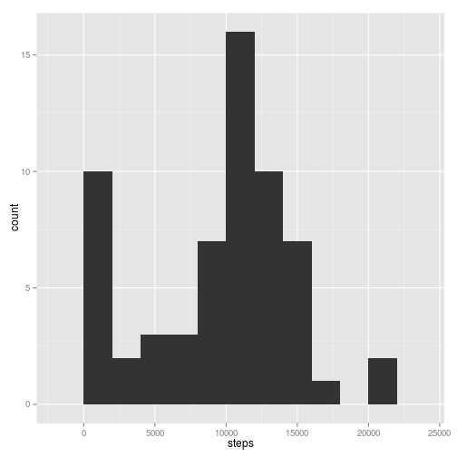
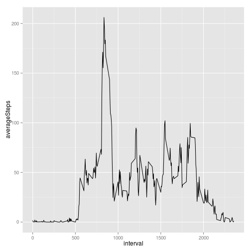
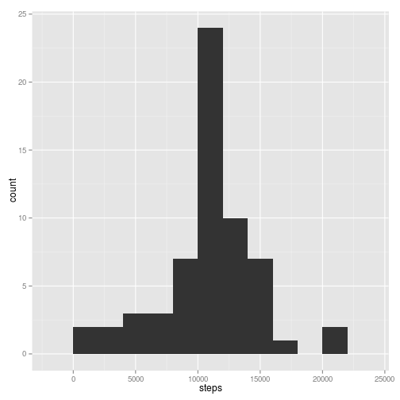
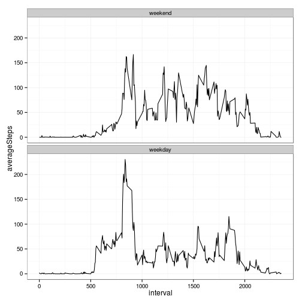

Reproducible Research: Peer Assessment 1
-----------------------------------------

**Note to markers:** For my 'report', I've just chosen to place my code chunks in between the instructions from 
the assignment readme file. I didn't see any marks in the rubric for a descriptive report, so I thought this 
would suffice.

Also I've heard laziness is a [virtue](http://threevirtues.com/) for programmers. 

Begin report:


### Loading and preprocessing the data

Show any code that is needed to

1. Load the data (i.e. `read.csv()`)


```r
unzip('activity.zip')
activityData <- read.csv('activity.csv')
```

2. Process/transform the data (if necessary) into a format suitable for your analysis

```r
#convert 'steps' from integer. Later on we will fill missing values
#with non-integer averages
activityData$steps <- as.numeric(activityData$steps)

#convert 'date' to an actual date type
activityData$date <- as.Date(activityData$date)
```

### What is mean total number of steps taken per day?

For this part of the assignment, you can ignore the missing values in
the dataset.

1. Make a histogram of the total number of steps taken each day

```r
library(dplyr)
library(ggplot2)
dailySteps <- 
  activityData %>% 
  group_by(date) %>% 
  summarise(steps = sum(steps,na.rm = TRUE))

qplot(data = dailySteps, x = steps, geom = "histogram", binwidth = 2000)
```

 

2. Calculate and report the **mean** and **median** total number of steps taken per day

```r
mean(dailySteps$steps, na.rm = TRUE)
```

```
## [1] 9354.23
```

```r
median(dailySteps$steps, na.rm = TRUE)
```

```
## [1] 10395
```


### What is the average daily activity pattern?

1. Make a time series plot (i.e. `type = "l"`) of the 5-minute interval (x-axis) and the average number of steps taken, averaged across all days (y-axis)

```r
stepsByInterval <- 
  activityData %>% 
  group_by(interval) %>% 
  summarise(averageSteps = mean(steps, na.rm = TRUE))

qplot(data = stepsByInterval, x = interval, y = averageSteps, geom = "line")
```

 

2. Which 5-minute interval, on average across all the days in the dataset, contains the maximum number of steps?

```r
#get interval value for row with highest average number of steps 
with(stepsByInterval, interval[which.max(averageSteps)])
```

```
## [1] 835
```

### Imputing missing values

Note that there are a number of days/intervals where there are missing
values (coded as `NA`). The presence of missing days may introduce
bias into some calculations or summaries of the data.

1. Calculate and report the total number of missing values in the dataset (i.e. the total number of rows with `NA`s)

```r
sum(!complete.cases(activityData))
```

```
## [1] 2304
```

2. Devise a strategy for filling in all of the missing values in the dataset. The strategy does not need to be sophisticated. For example, you could use the mean/median for that day, or the mean for that 5-minute interval, etc.

```r
#let's first check that only the 'steps' column is missing data
any(is.na(activityData$steps))
any(is.na(activityData$date))
any(is.na(activityData$interval))
```

```
## [1] TRUE
## [1] FALSE
## [1] FALSE
```


```r
#looks like we'll need a way to fill in a row with a missing 'steps' value
## Imputing strategy description:
#to fill a missing steps-value, just take the average value for the corresponding interval
getAverageStepVal <- function(givenInterval)
{
  with(stepsByInterval, averageSteps[which(interval == givenInterval)])
}
```

3. Create a new dataset that is equal to the original dataset but with the missing data filled in.

```r
activityDataFilled <-
  activityData %>%
  rowwise() %>%
  mutate(steps = ifelse(is.na(steps), getAverageStepVal(interval), steps))
```

4. Make a histogram of the total number of steps taken each day and Calculate and report the **mean** and **median** total number of steps taken per day. Do these values differ from the estimates from the first part of the assignment? What is the impact of imputing missing data on the estimates of the total daily number of steps?

```r
dailyStepsFilled <- 
  activityDataFilled %>% 
  group_by(date) %>% 
  summarise(steps = sum(steps))

qplot(data = dailyStepsFilled, x = steps, geom = "histogram", binwidth = 2000)
```

 

```r
mean(dailyStepsFilled$steps)
```

```
## [1] 10766.19
```

```r
median(dailyStepsFilled$steps)
```

```
## [1] 10766.19
```


### Are there differences in activity patterns between weekdays and weekends?

For this part the `weekdays()` function may be of some help here. Use
the dataset with the filled-in missing values for this part.

```r
activityData <- activityDataFilled
```


1. Create a new factor variable in the dataset with two levels -- "weekday" and "weekend" indicating whether a given date is a weekday or weekend day.

```r
activityData <- 
  activityData %>%
  mutate(
    dayType = factor(
      x = weekdays(date) %in% c("Sunday", "Saturday"),
      levels = c(T,F),
      labels = c('weekend', "weekday")
    )
  )
```

1. Make a panel plot containing a time series plot (i.e. `type = "l"`) of the 5-minute interval (x-axis) and the average number of steps taken, averaged across all weekday days or weekend days (y-axis). The plot should look something like the following, which was created using **simulated data**:


 


**Your plot will look different from the one above** because you will
be using the activity monitor data. Note that the above plot was made
using the lattice system but you can make the same version of the plot
using any plotting system you choose.


```r
#summarise by interval *and* dayType
stepsByInterval <- 
  activityData %>% 
  group_by(interval, dayType) %>% 
  summarise(averageSteps = mean(steps))

#create the plot:
ggplot(data = stepsByInterval) + 
  aes(x = interval, y = averageSteps) + 
  geom_line() + 
  facet_wrap(~ dayType, ncol = 1) + 
  theme_bw()
```

 
